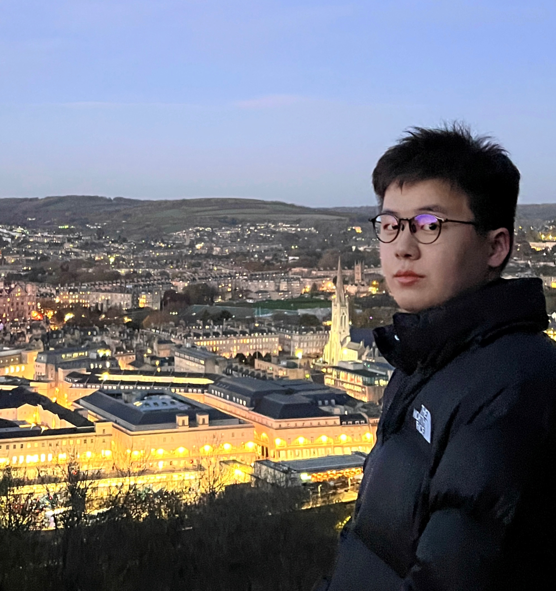

<!-- The method for setting the columns：https://www.v2ex.com/t/132636 
The method for setting picture border：https://blog.csdn.net/ProgramChangesWorld/article/details/51702679
-->

	

<!--

 

-->

# <small>Guanxuan (Grayson) Jiang</small> 

	Feel free to reach out to me through any method; please refer to my <i><b>contact information</b></i>.
	 
	<a href="https://github.com/jgxuann" >
	  <i class="fa fa-github"> </i>
	</a>
	<a href="https://www.linkedin.com/in/guanxuan-jiang-905156267/" >
	 <i class="fa fa-linkedin" aria-hidden="true"></i>
	</a>
	<a href="https://twitter.com/jgxuann" >
	<i class="fa fa-twitter"> </i>
	</a>
	<a href="https://www.instagram.com/jgxuann/" >
	<i class="fa fa-instagram"> </i>
	</a>

    		

	

 

 My name is Guanxuan Jiang (蒋冠宣), and I am an MPhil (Master of Philosophy) student in the <a href="https://www.hkust-gz.edu.cn/" target="_blank"> Hong Kong University of Science and Technology (Guangzhou)</a> with a full scholarship. My research interests are in the fields of Human-Computer Interaction (HCI), Human Behavior, Artificial Intelligence (AI), Virtual Reality (VR) and Augmented Reality (AR). I am member of <a href="https://mc2.hkust-gz.edu.cn" target="_blank">Center for <strong>M</strong>etaverse and <strong>C</strong>omputational <strong>C</strong>reativity (MC2) Lab</a>. I obtained my Bachelor of Science with Honour from the <a href="https://www.sheffield.ac.uk/dcs" target="_blank"> University of Sheffield</a> in the department of Computer Science with one-year Study Abroad at the <a href="https://www.cuhk.edu.hk/english/index.html" target="_blank"> Chinese University of Hong Kong</a>, supported by the Global Opportunity Organization and the Turning Scheme. 

#####<i><b>Contact Information:</b></i>

__Office:__ Room 318, Building E1, HKUST-GZ, Guangzhou, China 
__Email:__ gjiang240[at]connect[dot]hkust-gz[dot]edu[dot]cn (academic) or jgxuann[at]outlook[dot]com 
Or anyway you can find me 😎

----

##<small>Education</small>

	

`September 2023 - June 2025 (expected) `

- __Master of Philosophy (MPhil)__

- Hong Kong University of Science and Technology (Guangzhou) (HKUSTGZ), Guangzhou, China
- [Computational Media and Arts Thrust (CMA)](https://cma.hkust-gz.edu.cn/), Information Hub
- College of Future Technology (CFT)
- <a href="https://mc2.hkust-gz.edu.cn" target="_blank">Center for <strong>M</strong>etaverse and <strong>C</strong>omputational <strong>C</strong>reativity (MC2) Lab</a>
- Keywords: Human-Computer Interaction (HCI), Artificial Intelligence (AI), Metaverse
- Supervisor: <a href="https://panhui.people.ust.hk/" target="_blank"> Prof Pan Hui</a>, [FRENG](https://raeng.org.uk/news/news-releases/2020/september/academy-welcomes-53-leading-uk-and-international-e), [FIEEE](https://www.computer.org/press-room/2017-news/cs-fellows-2018), [MAE](https://www.ae-info.org/ae/Member/Hui_Pan), [Distinguished Scientist of ACM](https://awards.acm.org/award_winners/hui_1351201)
- Co-supervisors: <a href="https://ieda.ust.hk/dfaculty/tsung/" target="_blank"> Prof Fugee Tsung</a> and <a href="https://www.louis919.tech" target="_blank"> Prof Yuyang Wang</a>

	

`September 2020 - June 2023 `

- __Bachelor of Science with Honour (BSc.)__

- University of Sheffield (UoS), Sheffield, England
- [Department of Computer Science](https://www.sheffield.ac.uk/dcs), Faculty of Engineering
- Major: Computer Science
- Dissertation: ARMessageBoard: Location-Based Social Interaction with Augmented Reality (Distinction)
- Dissertation Advisors: <a href="https://ns-moosavi.github.io/" target="_blank"> Prof Nafise Sadat Moosavi</a> and <a href="https://imyueli.github.io/about.html" target="_blank"> Prof Yue Li </a>

	

`September 2021 - June 2022 `

- __Study Abroad__

- Chinses University of Hong Kong (CUHK), Shatin, Hong Kong
- [Shaw College](https://www.shaw.cuhk.edu.hk/en) , [Department of Computer Science and Engineering](https://www.cse.cuhk.edu.hk/)

	

`July 2021 - August 2021 `

- __Summer School__

- [Peking University](https://www.pku.edu.cn/), Beijing, China

----

##<small>Resaerch Experience</small>

	

`May 2022 - October 2022`

- __Laboratory Team Member__

- [Center for <strong>M</strong>etaverse and <strong>C</strong>omputational <strong>C</strong>reativity (MC2) Lab</a>](https://mc2.hkust-gz.edu.cn), Guangzhou, China
- Computational Media and Arts Thrust (CMA)
- Supervisors: Prof Pan Hui and [Prof Yuyang Wang](https://mc2.hkust-gz.edu.cn/personnel_data/yuyang-wang/)
- Keywords: Human Computer Interaction (HCI), Artificial Intelligence (AI), Collaboration, Metaverse

	

`May 2022 - October 2022`

- __Research Assistant__

- [Xi'an Jiaotong-Liverpool University](https://www.xjtlu.edu.cn/en), Suzhou, China
- Department of Computing, School of Advanced Technology
- Collaborating Supervisor: [Prof Yue Li](https://imyueli.github.io/about.html)
- Keywords: Human Computer Interaction (HCI), Virtual Reality (VR), Augmented Reality (AR)

----

##<small>Working Experience</small>

`March 2021 - June 2021`

- __Science and Technology Innovation Division__

- [Beijing ANTIY Network Security Technology Co. LTD](https://www.antiy.cn/), Beijing, China
- Keywords: Attack Capture System, ANTIY(RWD)

----

##<small>Fundings</small>

`June 2022`

- __Summer Undergraduate Research Fellowships ([SURF](https://academicpolicy.xjtlu.edu.cn/article.php?id=12))__

- The Support of the Research Fund from the Department of Computing, School of Advanced Technology, XJTLU

`June 2021 `

- __Study Abroad with Finance Support__

- 85% Tuition Waiver from the [Global Opportunity Organization](https://www.sheffield.ac.uk/globalopps), University of Sheffield, £20,000

`November 2021`

- __Turning Scheme Grant from United King Government__

- The [Turning Scheme](https://www.turing-scheme.org.uk/) is Held by United Kingdom Government for Abroad (National), £3,000

----

##<small>Awards</small>

`September 2023 - June 2025(expected)`

- __Full Postgraduate Studentship (PGS) Award from Guangzhou Government__

- The PGS Rate is CNY10,000 Per Month

`November 2022`

- __Second Prize in the Final of the 5th China Competition on Virtual Reality__

-  The Project Named ‘Virtual Chemistry Laboratory‘, Among 1,000+ Teams, [CCVR2022](https://ccvr2022.aconf.cn/) (National Award)

`Januray 2021`

- __Professional Behaviors Team Award in Global Engineering Challenge Projects__

- [United Kingdom Standard for Professional Engineering Competence (UKSPEC)](https://www.engc.org.uk/ukspec), University of Sheffield

`June 2020`

- __International Computer Science Excellence Scholarship__

- [Excellent Academic Performance](https://www.sheffield.ac.uk/engineering/study/scholarships-international-excellence) before First-year Entrance, The University of Sheffield, £2,000

----

##<small>Extracurricular Activities</small>
`July 2023`

- __[2023 Red Bird Challenge Camp](https://vptlo.hkust-gz.edu.cn/rbcc/index/tzy_about_CN.html)__
- Nansha, Guangzhou, Guangdong, China

`May 2022`

- __[2022 Conference on Human Factors in Computing System](https://chi2022.acm.org/)__
- New Orleans, United States

- Attending Lectures: C12: Inclusion Techniques for Team Practices in HCI & C13: Wearable Technology Design and Accessibility Considerations Course.

`July 2020`

- __[TENCENT Rhinoceros Bird Elite Research Camp](https://ur.tencent.com/)__
- Shenzhen, Guangdong, China

##<small>Teachings</small>
`Fall Semester 2024`

- __Teaching Assistant__
- HKUST-GZ, Guangzhou, China

- UCMP6030 Cross-disciplinary Design Thinking

`September 2024`

- __Instructional Deliver__
- HKUST-GZ, Guangzhou, China

- PDEV6800 Introduction to Teaching and Learning in Higher Education

##<small>Service & Volunteer</small>
`June 2021 - June 2022`

- __[Chinese Students and Scholars Association, Sheffield (CSSA-Sheffield)](https://cssasheffield.com/)__
- Sheffield, England

- Academic Department 

`July 2019`

- __[YIK International Volunteer Service Center](http://www.yikiv.com/)__
- Maldives, Himmafushi

- Volunteered in Himmafushi, one of the Inhabited Islands of Kaafu Atoll in the Maldive, over 120 hours.

`May 2019`

- __[The 2019 Changchun International Marathon](https://sports.cctv.com/2019/05/26/VIDELNTiJN30erYlzDndIW38190526.shtml)__
- Changchun, China

- Volunteered in the International Affairs Department.

##<small>Publications</small>

__Guanxuan Jiang__, Yuyang Wang and Pan Hui*. _Experimental Exploration: Investigating Cooperative Interaction Behavior Between Humans and Large Language Model Agents._ The 28th ACM SIGCHI Conference on Computer-Supported Cooperative Work & Social Computing. __CSCW'25__. Under Review.

Simin Yang, __Guanxuan Jiang__, Reza Hadi Mogavi and Pan Hui*. _Digital Pets to Support Psychological Well-being: A Qualitative Study of Ideal Digital Pets from the Perspectives of College Students_. The 44th ACM CHI Conference on Human Factors in Computing Systems. __CHI'25__. Under Review.

__Guanxuan Jiang__, Yuyang Wang, Yue Li, Nafise Sadat Moosavi and Pan Hui, _“Blending Social Interaction Realms: Harmonizing Online and Offline Interactions through Augmented Reality”._ In: Proceedings of the 17th ACM International Symposium on Visual Information Communication and
Interaction. __VINCI 2024__, December 11-13, 2024. Hsinchu, Taiwan, China. <a href="https://doi.org/10.1145/3678698.3678700" style="display: inline-block; text-decoration: underline;">
  DOI: 10.1145/3678698.3678700
</a>

__Guanxuan Jiang1,2__, Xunsheng Xia1, 2, Yue Li*, Hai-Ning Liang and Pan Hui, _“ChemistryVR: Enhancing Educational Experiences through Virtual Chemistry Lab Simulations”._ In: Processding of the 17th ACM Special Interest Group on Computer Graphics Asia, Education Papers. __SIGGRAPH Asia 2024__, December 3-6, 2024. Tokyo, Japan. Accepted (confirmed).

_Page last revised on: {{ git_revision_date }}_

<!-- The globe collects visitor statistics

-->

<!-- Visitor statistics

-->

<!-- Contact with me： contact form

-->

<!-- Share to social media icons
Find more here: https://sharethis.com/zh-tw/
-->

<!--*****************************************************************************************************>
<!-- 
-->

<!-- Go to www.addthis.com/dashboard to customize your tools 

-->

